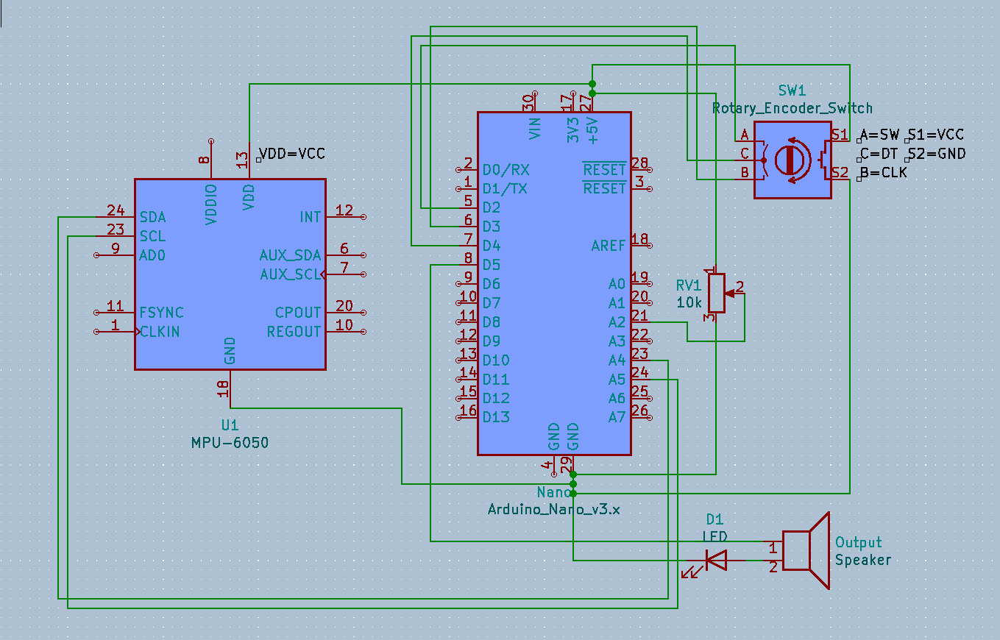

# BitBangerG1
A bit banging gyro powered noise box synth built with Arduino.

Use the potentiometer and gyroscope to change the patch parameters. 

Work in progress.

## Features
* Makes noise
* Stops making noise

## Required Components
* Arduino Nano (or compatible dev board)
* Rotary Knob
* 10k Potentiometer
* MPU6050 (Gyro/Accelerometer)

## Required Libraries
* Adafruit_MPU6050(https://github.com/adafruit/Adafruit_MPU6050)
* Adafruit_Sensor(https://github.com/adafruit/Adafruit_Sensor)

## Usage
* Turn rotary knob to change patch. 
* Flail device about haphazardly to produce terrible noises
* Turn potentiometer to change patch parameter
* Press rotary knob to end the madness (mute)

## Wiring
Wiring schematics are made with Kicad and available as part of this repo. 

[Click here for full Kicad files](kicad/)

[Click here for full resolution diagram only](kicad/Full.png)

